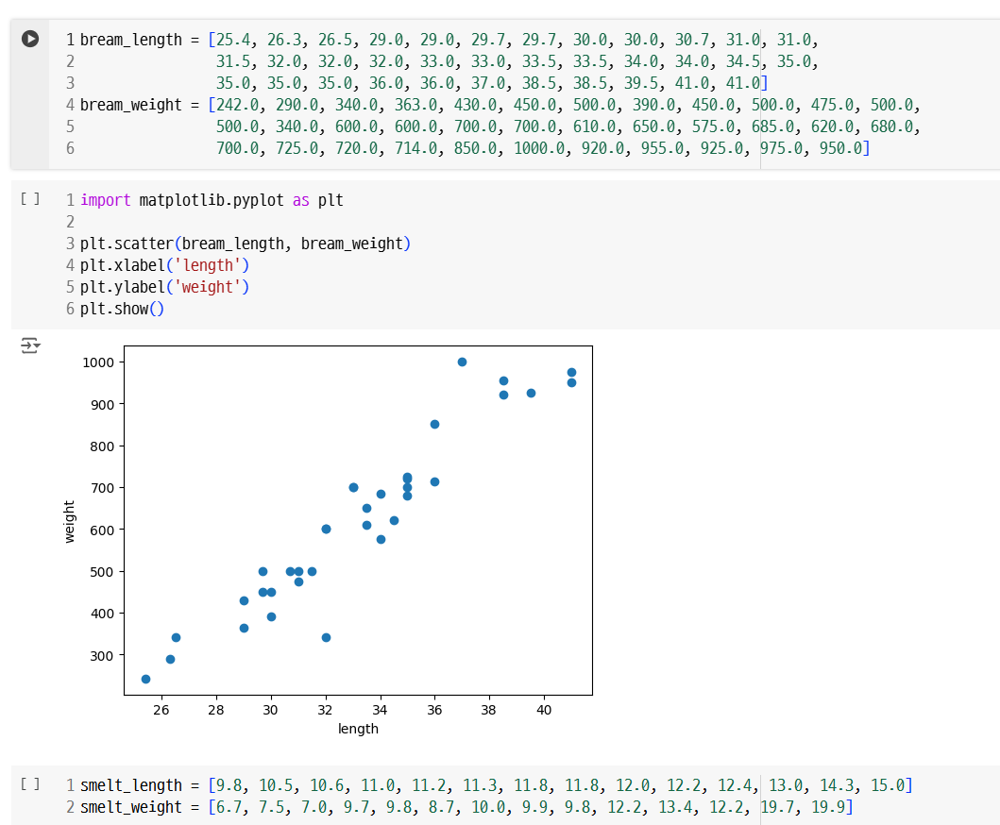
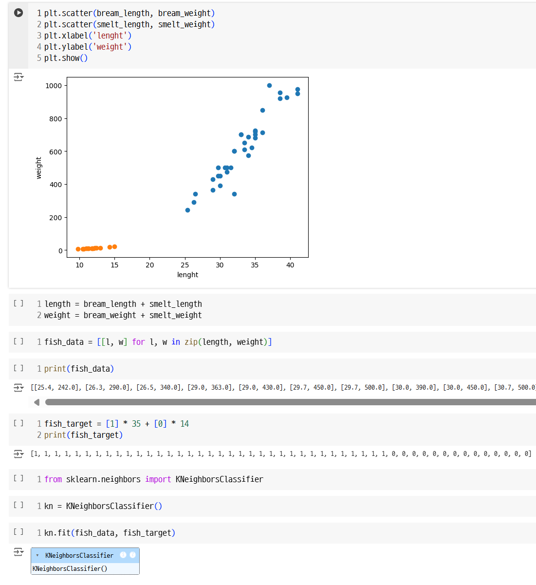
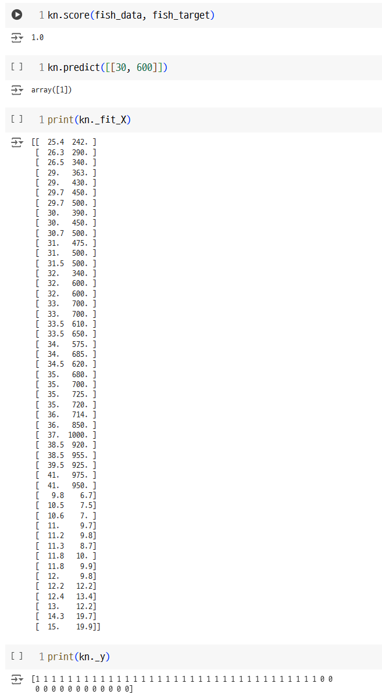
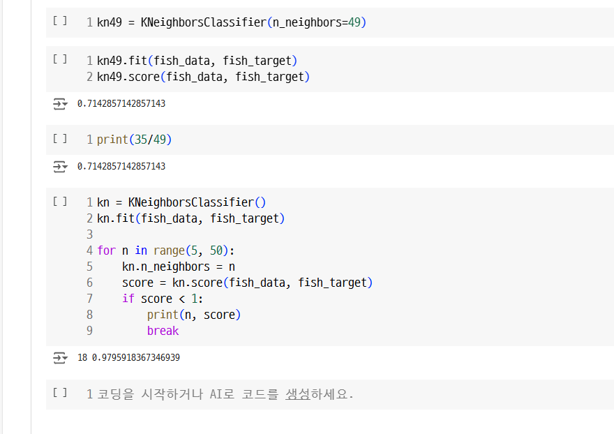
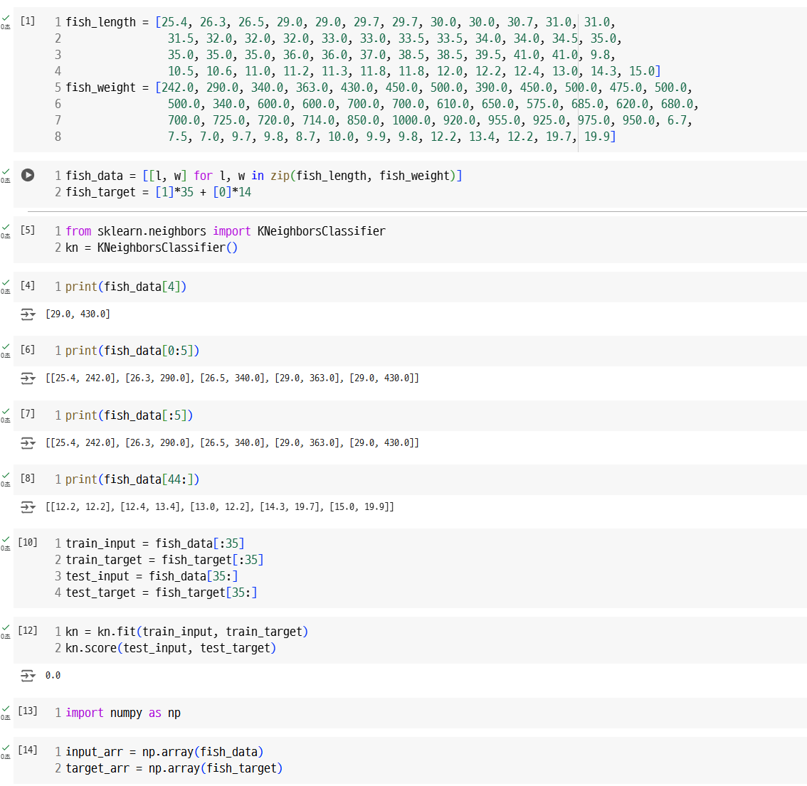
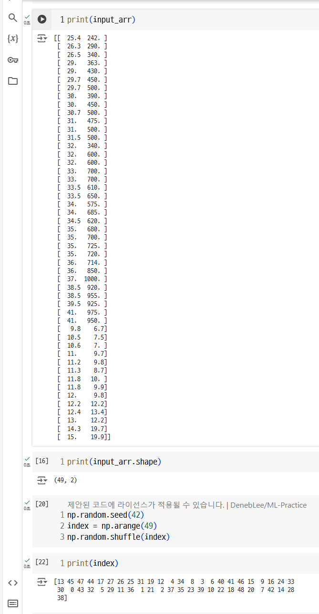
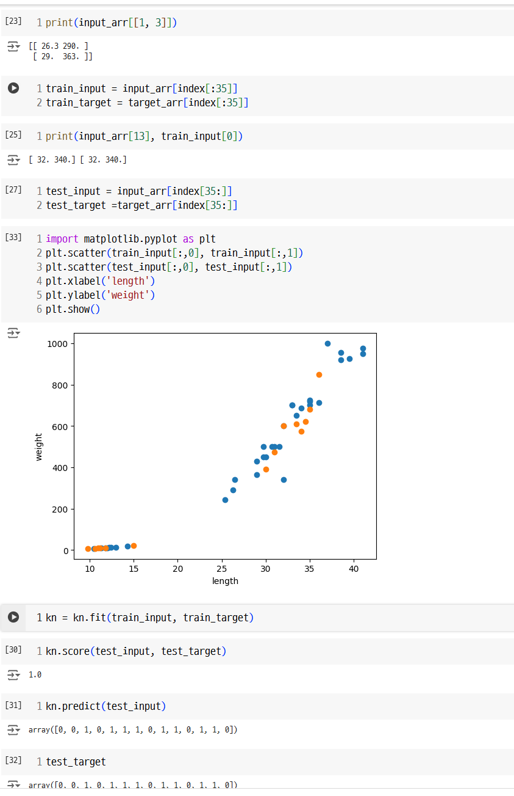

###01-1~02-1

인공지능(artificial intelligence) : 학습하고 추론할 수 있는 지능을 가진 컴퓨터 시스템을 만드는 기술

강인공지능 : 인공일반지능이라고도 하고 사람의 지능과 유사함
약인공지능 : 특정분야에서 사람을 돕는 보조 AI

머신러닝: 데이터에서 규칙을 학습하는 알고리즘을 연구하는 분야(대표 라이브러리-사이킷런)
딥러닝 : 인공신경망을 기반으로 한 머신러닝 분야를 일컬음(대표 라이브러리 - 텐서플로,파이토치)

특성 : 데이터를 표현하는 특징(ex.생선의 길이와 무게)

K-최근접 이웃 알고리즘 : 가장 간단한 머신러닝 알고리즘 중 하나로 어떤 규칙을 찾기보다는 인접한 샘플을 기반으로 예측을 수행함

훈련: 머신러닝 알고리즘이 데이터에서 규칙을 찾는 과정 또는 모델에 데이터를 전달하여 규칙을 학습하는 과정

-사이킷런 모델을 훈련할 때 사용하는 메서드 - fit()

지도 학습 : 입력(데이터)과 타깃(정답)으로 이뤄진 훈련 데이터가 필요하며 새로운 데이터를 예측하는 데 활용함. (K-최근접 이웃 알고리즘)

비지도 학습 : 타깃 데이터 없이 입력 데이터만 있을 때 사용.
이런 종류의 알고리즘은 정답을 사용하지 않으므로 무언가를 맞힐 수가 없는 대신 데이터를 잘 파악하거나 변형하는데 도움을 줌

-모델을 훈련할 때는 훈련 세트를 사용하고 평가는 테스트 세트로 함.

샘플링 편향 : 훈련 세트와 테스트 세트에 샘플이 고르게 섞여 있지 않을 때 나타남. 제대로 된 지도 학습 모델을 만들 수 없음.

실습한 코드

