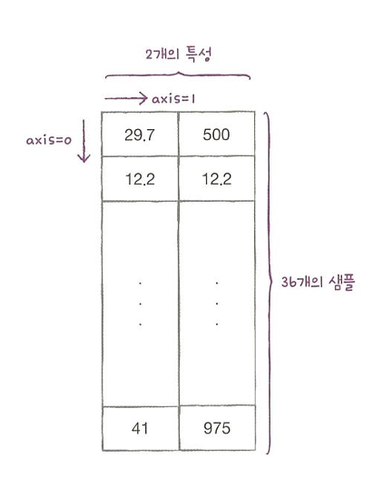
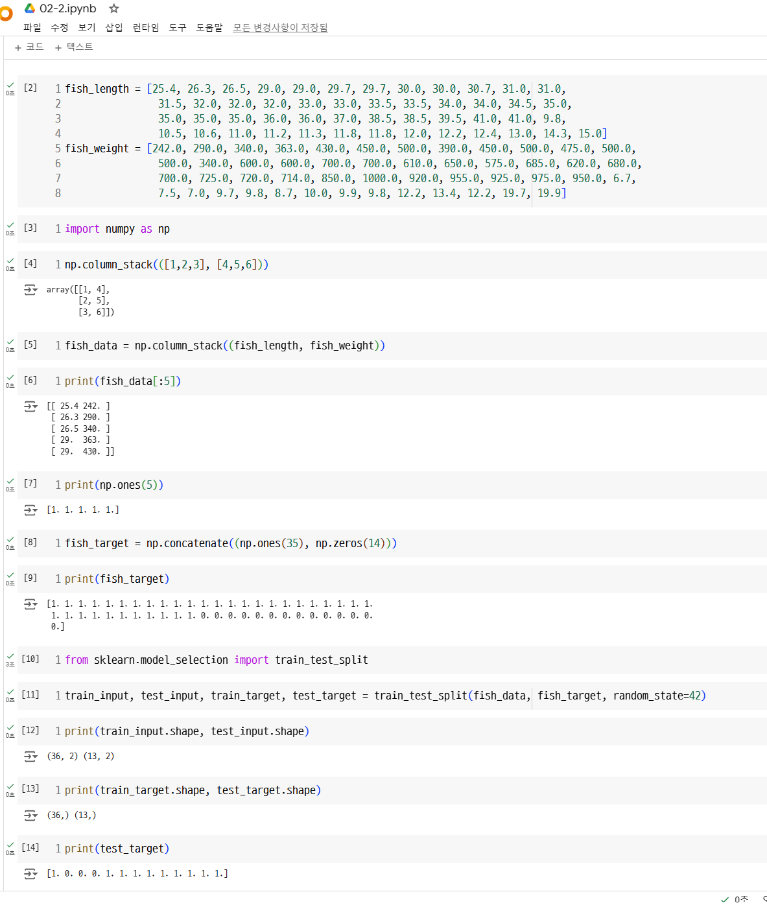
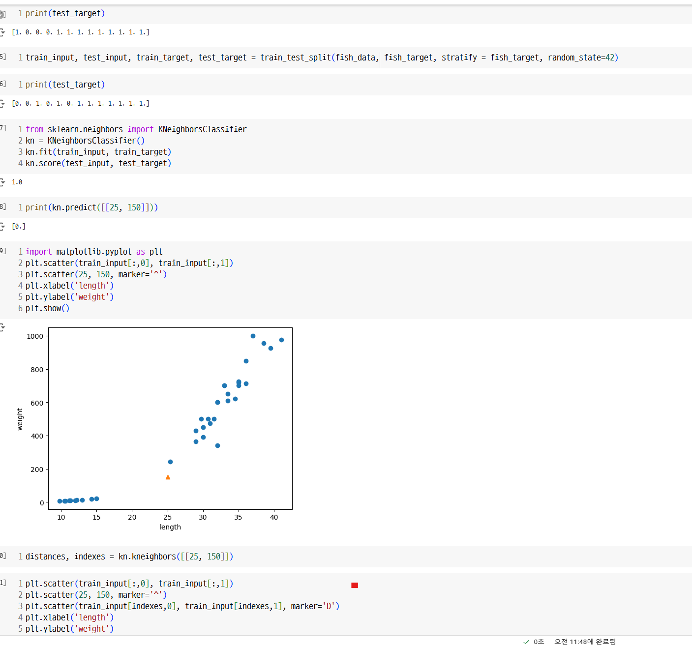
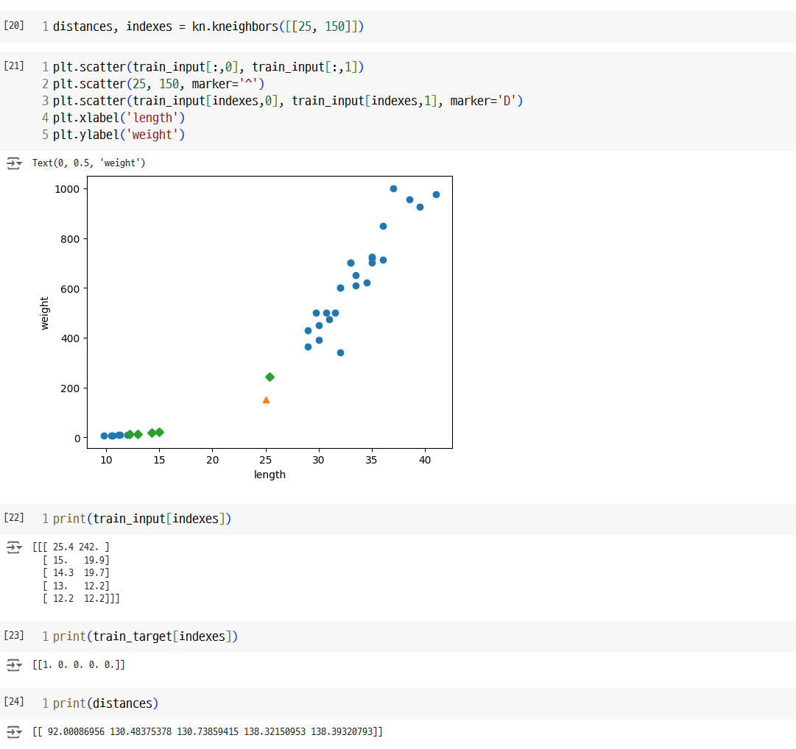
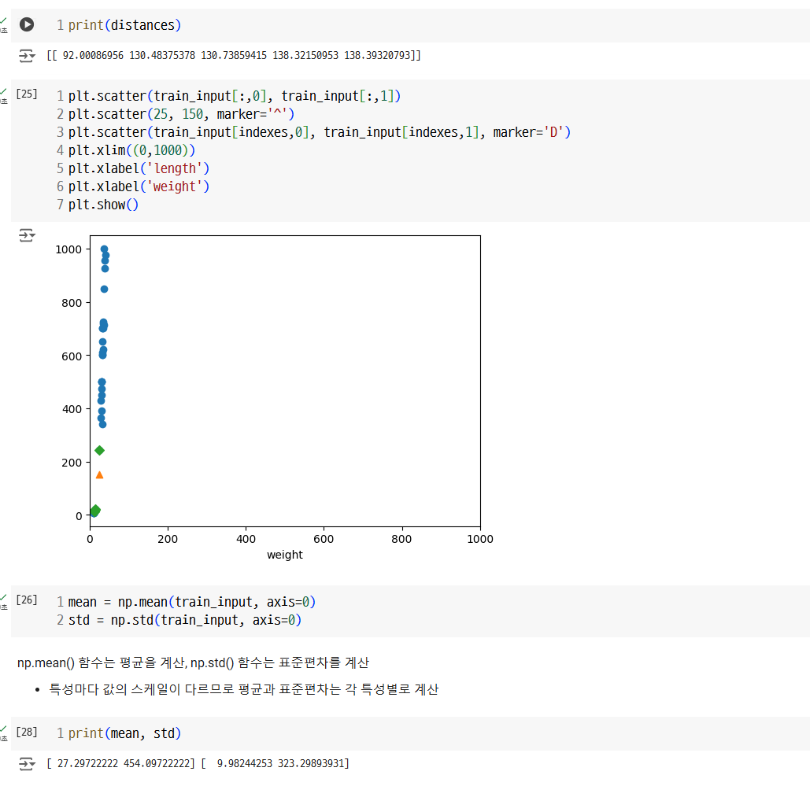
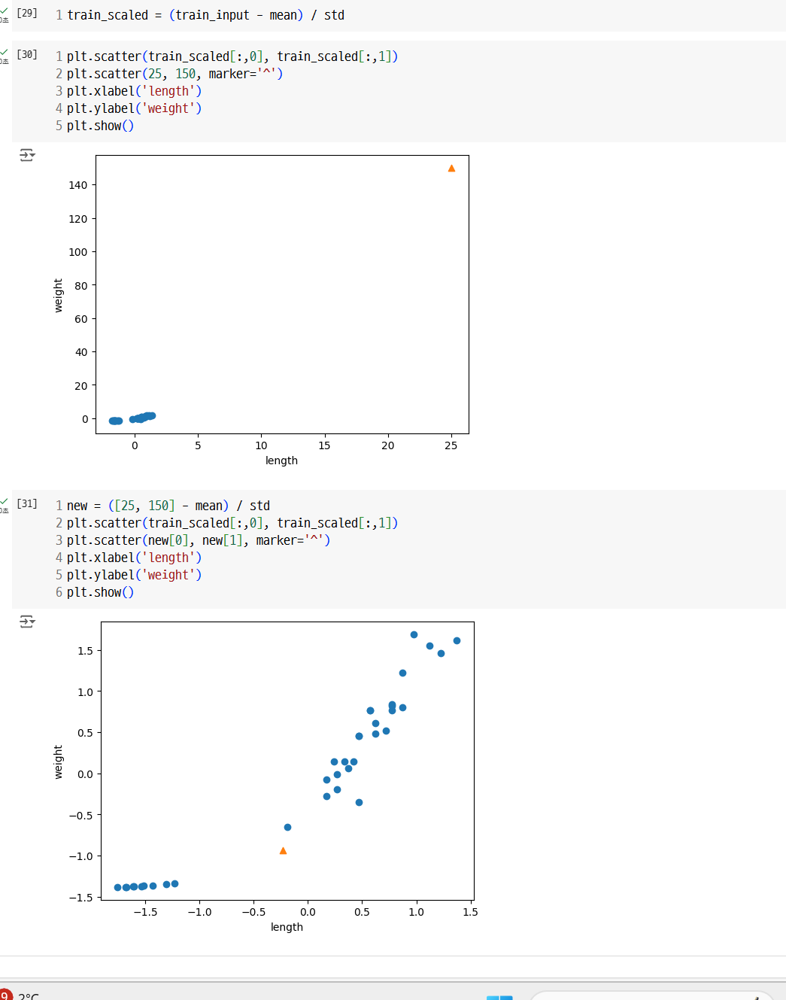
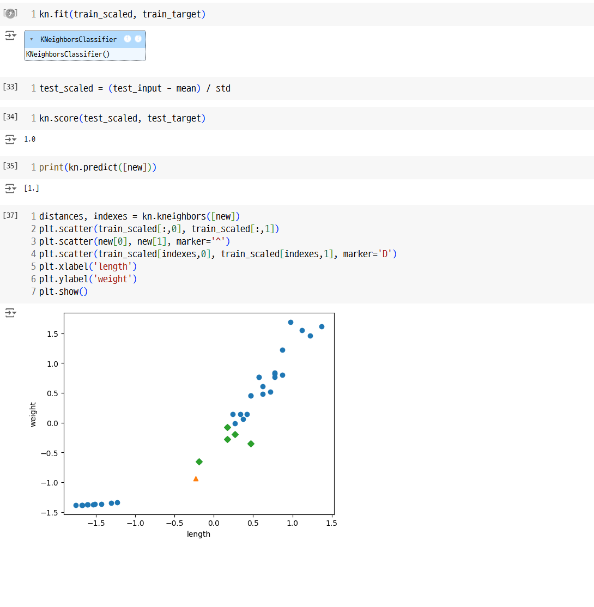

- 머신러닝 모델의 성능을 신뢰할 수 있음을 보여주기 위해 훈련 데이터를 훈련 세트와 테스트 세트로 나눔

column_stack() => 전달받은 리스트를 일렬로 세운 다음 차례대로 나란히 연결

| **특성**           | **튜플 (Tuple)**                           | **리스트 (List)**                               |
| ------------------ | ------------------------------------------ | ----------------------------------------------- |
| **가변성**         | 불변 (Immutable)                           | 가변 (Mutable)                                  |
| **선언 방식**      | 소괄호 `()` 사용                           | 대괄호 `[]` 사용                                |
| **수정 가능 여부** | 생성 후 요소 추가, 삭제, 수정 불가         | 요소 추가, 삭제, 수정 가능                      |
| **순서 유지 여부** | 순서가 있음                                | 순서가 있음                                     |
| **인덱스 접근**    | 인덱스를 사용하여 요소에 접근 가능         | 인덱스를 사용하여 요소에 접근 가능              |
| **성능**           | 상대적으로 빠름 (불변이므로 최적화에 유리) | 상대적으로 느림 (가변 연산 때문에 비용 증가)    |
| **메모리 사용량**  | 더 적은 메모리 사용                        | 더 많은 메모리 사용                             |
| **사용 목적**      | 변경이 필요 없는 데이터 저장               | 변경 및 업데이트가 필요한 데이터 저장           |
| **메서드 지원**    | 제한적 (예: `count()`, `index()`만 지원)   | 다양함 (예: `append()`, `extend()`, `pop()` 등) |
| **해시 가능 여부** | 해시 가능 (요소도 해시 가능해야 함)        | 해시 불가능                                     |
| **사용 사례**      | 딕셔너리 키, 데이터 고정                   | 리스트 작업, 반복적 데이터 조작                 |

사이킷런은 머신러닝 모델을 위한 알고리즘뿐만 아니라 다양한 유틸리티 도구도 제공. (ex.train_test_split() 함수)

train_test_split() => 전달되는 리스트나 배열을 비율에 맞게 훈련 세트와 테스트 세트로 나누어 줌 (샘플링 편향 해결 방안)
(ex stratify)

튜플의 원소가 하나면 원소 뒤에 콤마를 추가합니다. 이 예에서 타깃 데이터는 1차원 배열이므로 원소가 하나인 튜플로 표현되었습니다.

- k-최근접 이웃은 주변의 샘플 중에서 다수인 클래스를 예측으로 사용함

KNeighborsClassifier 클래스는 주어진 샘플에서 가장 가까운 이웃을 찾아주는 kneighbors() 매서드를 제공함. (이웃까지의 거리와 이웃 샘플의 인덱스를 반환)

x축 범위 지정 => xlim()
y축 범위 지정 => ylim()

범위 = 스케일

데이터 전처리 : 머신러닝 모델에 훈련 데이터를 주입하기 전에 가공하는 단계 (ex.표준점수)

표준점수(z 점수): 각 특성값이 평균에서 표준편차의 몇 배만큼 떨어져 있는지 나타냄, 훈련세트의 스케일을 바꾸는 대표적인 방법 중 하나로 표준 점수를 얻으려면 특성의 평균을 빼고 표준편차로 나눔.

분산 구하는 법 : 데이터에서 평균을 뺀 값을 모두 제곱한 다음 평균을 내어 구함.

표준편차 구하는 법: 분산의 제곱근

-axios=0 각 열에 대한 결과 반환
-axios=1 각 행에 대한 결과 반환

브로드캐스팅 : 넘파이 배열 사이에서 일어남. 크기가 다른 넘파이 배열에서 자동으로 사칙 연산을 모든 행이나 열로 확장하여 수행하는 기능

- 테스트 세트를 평가할 때, 훈련 세트의 기준으로 테스트 세트를 변환해야함

실습 코드

