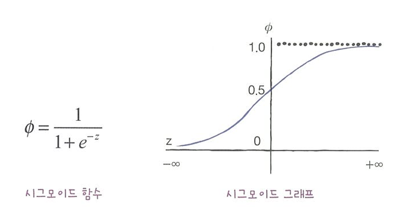
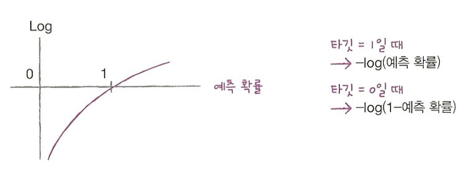
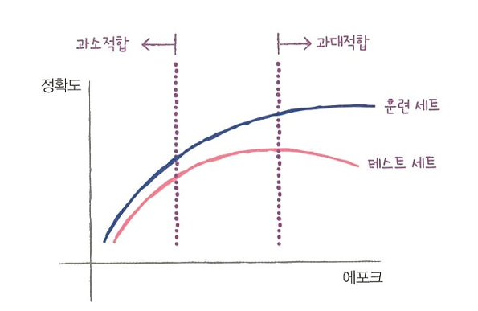

로지스틱 회귀: 선형 방정식을 사용한 분류 알고리즘
-> 회귀로 연속적인 결과를 시그모이드 함수로 표준화시켜서 특정값을 기준으로 나누어서 "분류"하는 것

이름은 회귀이지만 분류 모델 !!

다중분류: 타깃 클래스가 2개 이상인 분류 문제 이다.
-> 소프트맥스 함수를 사용하여 클래스를 예측합니다.

시그모이드 함수: 선형 방정식의 출력을 0과 1사이의 값으로 압축하며 이진 분류를 위해 사용함

소프트맥스 함수: 다중 분류에서 여러 선형방정식의 출력 결과를 정규화 하여 합이 1이 되도록 만듦

LogisticRegression : 선형 분류 알고리즘인 로지스틱 회귀를 위한 클래스
-> solver 매개변수에서 사용할 알고리즘을 선택할수 있음 (기본값: 1bfgs)

predict_proba(): 예측 확률을 반환

이진분류-> 샘플마다 음성 클래스와 양성 클래스에 대한 확률을 반환
다중분류-> 샘플마다 모든 클래스에 대한 확률을 반환
decision_function(): 모델이 학습한 선형방정식의 출력을 반환

이진분류-> 로지스틱 회귀 함수, 양성 클래스 확률 반환(0보다 크면 양성 클래스, 0보다 작으면 음성클래스)

다중분류-> 크로스엔트로피 손실 함수, 각 크래스 마다 선형 방정식을 계산(가장 큰 값의 클래스가 예측 클래스)

확률적 경사하강법: 훈련세트에서 샘플 하나씩 꺼내 손실 함수의 경사를 따라 최적의 모델을 찾는 알고리즘. 샘플을 하나씩 사용하지 않고 여러개를 사용하면 미니배치 경사하강법이 됌(한번에 전체 샘플을 사용하면 배치 경사 하강법이 됌)
손실함수: 확률적 경사 하강법이 최적하할 대상

에포크: 확률적 경사 하강법에서 전체 샘플을 모두 사용하는 한번의 반복
->일반적으로 경사하강법 알고리즘은 수십에서 수백번의 에포크를 반복

SGDClassifier : 확률적 경사 하강법을 사용한 분류 모델을 만듦음
loss 매개변수: 확률적 경사 하강법을 사용한 분류 모델을 만듦(기본값: 서포트 벡터 머신을 위한 hinge 손실함수)
힌지 손실(서포트 벡터 머신): 머신러닝 알고리즘을 위한 손실 함수
max_iter 매개변수: 에포크 횟수를 지정(기본값: 1000)
SGDRegressor : 확률적 경사 하강법을 사용한 회귀 모델을 만듦

