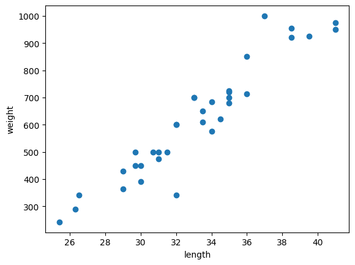

# 1주차

# Chapter 01. 첫 머신러닝

## 01-1. 인공지능과 머신러닝, 딥러닝

**머신러닝 machine learning**

- 자동으로 데이터에서 규칙을 학습하는 알고리즘
- 인공지능의 지능을 구현하기 위한 소프트웨어를 담당
- 사이킷런 라이브러리

**딥러닝 deep learning**

- 인공 신경망 artificial neurl network를 기반으로 한 방법

## 01-2. 마켓과 머신러닝

_k-최근접 이웃을 사용하여 2개의 종류(`클래스`)를 분류(`이진분류`)하는 머신러닝 모델을 훈련_

### 생선 분류 문제

도미의 데이터를 아래와 같이 준비한다.

```python
bream_length = [25.4, 26.3, 26.5, 29.0, 29.0, 29.7, 29.7, 30.0, 30.0, 30.7, 31.0, 31.0, 31.5, 32.0, 32.0, 32.0, 33.0, 33.0, 33.5, 33.5, 34.0, 34.0, 34.5, 35.0, 35.0, 35.0, 35.0, 36.0, 36.0, 37.0, 38.5, 38.5, 39.5, 41.0, 41.0]
bream_weight = [242.0, 290.0, 340.0, 363.0, 430.0, 450.0, 500.0, 390.0, 450.0, 500.0, 475.0, 500.0, 500.0, 340.0, 600.0, 600.0, 700.0, 700.0, 610.0, 650.0, 575.0, 685.0, 620.0, 680.0, 700.0, 725.0, 720.0, 714.0, 850.0, 1000.0, 920.0, 955.0, 925.0, 975.0, 950.0]
```

길이와 무게로 표현된 도미의 특징을 **`특성 feature`**이라고 한다.

```python
import matplotlib.pyplot as plt

plt.scatter(bream_length, bream_weight)
plt.xlabel('length')
plt.ylabel('weight')
plt.show()
```



위와 같이, 산점도 그래프가 일직선에 가까운 형태로 나타나는 경우 **`선형적 linear`**이라고 한다.

빙어 데이터를 아래와 같이 준비한다.

```python
smelt_length = [9.8, 10.5, 10.6, 11.0, 11.2, 11.3, 11.8, 11.8, 12.0, 12.2, 12.4, 13.0, 14.3, 15.0]
smelt_weight = [6.7, 7.5, 7.0, 9.7, 9.8, 8.7, 10.0, 9.9, 9.8, 12.2, 13.4, 12.2, 19.7, 19.9]
```

```python
plt.scatter(bream_length, bream_weight)
plt.scatter(smelt_length, smelt_weight)
plt.xlabel('length')
plt.ylabel('weight')
plt.show()
```


빙어의 산점도는 선형적이지만, 도미에 비교해서 상대적으로 무게가 길이에 영향을 덜 받는 것으로 나타난다.

### k-최근접 이웃 k-Nearest Neighbors 알고리즘

알고리즘을 통해 구분할 데이터셋 생성

```python
# dataset 생성
length = bream_length + smelt_length
weight = bream_weight + smelt_weight
```

사이킷런(scikit-learn) 라이브러리에서는 2차원 리스트 형태를 분석할 수 있으므로, 아래와 같이 전처리한다.

```python
fish_data = [[l, w] for l, w in zip(length, weight)]
```

이진 분류에서, 찾으려는 대상은 1로 놓고, 그 외에는 0으로 놓는다. 따라서, 도미를 1로 놓고 빙어를 0으로 하는 정답 리스트를 아래와 같이 생성할 수 있다.

```python
# 정답 리스트 생성
fish_target = [1] * 35 + [0] * 14
print(fish_target)
```

사이킷런 패키지의 k-최근접 이웃 알고리즘 클래스인 KNeighborsClassifier를 임포트한다.

```python
# 클래스 임포트
from sklearn.neighbors import KNeighborsClassifier
```

```python
kn = KNeighborsClassifier()
```

fit() 메소드를 활용하여 알고리즘을 **`훈련 training`**한다.

```python
kn.fit(fish_data, fish_target)
```

score() 메소드를 활용하여 **`모델 model`**을 평가한다.

```python
kn.score(fish_data, fish_target)
```

**`정확도 accuracy`**가 1.0이므로 도미와 빙어를 완벽하게 분리한 모델을 만들었다.

길이 30, 무게 600인 생선을 모델을 통해 평가해보자.

```python
kn.predict([[30, 600]])
```

1이 출력되므로 생선은 도미로 분류됨을 알 수 있다.

k-최근접 이웃 알고리즘은 데이터 간의 직선 거리를 계산한다. 데이터가 많은 경우 사용하기 어렵다.

KNeightborClassifier 클래스에서는 값을 분류하는 데 참고할 가장 가까운 데이터 개수의 기본값으로 5를 사용한다. 아래와 같이 n_neightbors 매개변수를 통해 참고할 데이터의 개수를 지정할 수 있다.

```python
kn49 = KNeighborsClassifier(n_neighbors=49)
```

```python
kn49.fit(fish_data, fish_target)
kn49.score(fish_data, fish_target)
```

모든 값을 참고하여 훈련 및 평가를 진행하게 되면 정확도가 떨어진다.

# Chapter 02. 데이터 다루기

## 02-1. 훈련 세트와 테스트 세트

머신러닝 알고리즘은 **`지도 학습 supervised learning`**과 **`비지도 학습 unsupervised learning`**으로 나뉜다.

지도 학습 알고리즘은 **`훈련 데이터 training data`**로써 데이터와 정답이 필요하며, 이를 각각 **`입력 input`**과 **`타깃 target`**이라 한다.

알고리즘을 평가하려면 평가에 사용되는 **`테스트 세트`**와 훈련에 사용되는 **`훈련 세트`**가 달라야 한다.

생선 데이터를 아래와 같이 준비한다.

```python
fish_length = [25.4, 26.3, 26.5, 29.0, 29.0, 29.7, 29.7, 30.0, 30.0, 30.7, 31.0, 31.0,
                31.5, 32.0, 32.0, 32.0, 33.0, 33.0, 33.5, 33.5, 34.0, 34.0, 34.5, 35.0,
                35.0, 35.0, 35.0, 36.0, 36.0, 37.0, 38.5, 38.5, 39.5, 41.0, 41.0, 9.8,
                10.5, 10.6, 11.0, 11.2, 11.3, 11.8, 11.8, 12.0, 12.2, 12.4, 13.0, 14.3, 15.0]
fish_weight = [242.0, 290.0, 340.0, 363.0, 430.0, 450.0, 500.0, 390.0, 450.0, 500.0, 475.0, 500.0,
                500.0, 340.0, 600.0, 600.0, 700.0, 700.0, 610.0, 650.0, 575.0, 685.0, 620.0, 680.0,
                700.0, 725.0, 720.0, 714.0, 850.0, 1000.0, 920.0, 955.0, 925.0, 975.0, 950.0, 6.7,
                7.5, 7.0, 9.7, 9.8, 8.7, 10.0, 9.9, 9.8, 12.2, 13.4, 12.2, 19.7, 19.9]
```

```python
fish_data = [[l, w] for l, w in zip(fish_length, fish_weight)]
fish_target = [1]*35 + [0]*14
```

49개의 샘플 sample을 가진 데이터가 만들어진다. 이 중 35개를 훈련 세트로, 나머지 14개를 테스트 세트로 사용하자.

```python
# 훈련 세트와 테스트 세트를 분리
train_input = fish_data[:35]
train_target = fish_target[:35]

test_input = fish_data[35:]
test_target = fish_target[35:]
```

모델을 훈련하고 평가하면, 0.0이라는 기적의 정확도가 출력된다.

이는 **`샘플링 편향 sampling bias`**에 의한 것이다.

```
kn.fit(train_input, train_target)
kn.score(test_input, test_target)
```

### 샘플링 편향을 해결한 훈련 데이터를 이용한 K-최근접 이웃 모델

샘플링 편향을 해결하기 위해 Numpy 라이브러리의 random 클래스를 이용하자.

```python
import numpy as np
```

```python
input_arr = np.array(fish_data)
target_arr = np.array(fish_target)
```

```python
index = np.arange(49)
np.random.shuffle(index)
```

```python
train_input = input_arr[index[:35]]
train_target = target_arr[index[:35]]

test_input = input_arr[index[:35]]
test_target = target_arr[index[:35]]
```

```python
import matplotlib.pyplot as plt

plt.scatter(train_input[:, 0], train_input[:, 1])
plt.scatter(test_input[:, 0], test_input[:, 1])
plt.xlabel('length')
plt.ylabel('weight')
plt.show()
```


```python
kn = kn.fit(train_input, train_target)

kn.score(test_input, test_target)
```

샘플링 편향을 해결한 데이터로 모델을 훈련한 결과이다. 1.0의 높은 정확도를 보여주었다.

```python
kn.predict(test_input)
```
