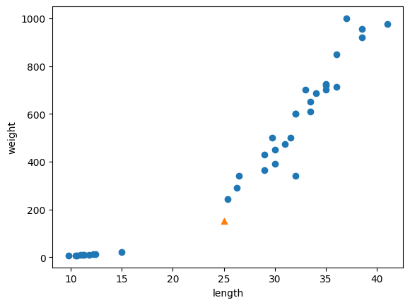

# 2주차

# Chapter 02. 데이터 다루기

## 02-2. 데이터 전처리

`데이터 전처리` `표준 점수` `브로드캐스트`

### Numpy 함수를 이용한 데이터 준비

```python
fish_length = [25.4, 26.3, 26.5, 29.0, 29.0, 29.7, 29.7, 30.0, 30.0, 30.7, 31.0, 31.0,
                31.5, 32.0, 32.0, 32.0, 33.0, 33.0, 33.5, 33.5, 34.0, 34.0, 34.5, 35.0,
                35.0, 35.0, 35.0, 36.0, 36.0, 37.0, 38.5, 38.5, 39.5, 41.0, 41.0, 9.8,
                10.5, 10.6, 11.0, 11.2, 11.3, 11.8, 11.8, 12.0, 12.2, 12.4, 13.0, 14.3, 15.0]
fish_weight = [242.0, 290.0, 340.0, 363.0, 430.0, 450.0, 500.0, 390.0, 450.0, 500.0, 475.0, 500.0,
                500.0, 340.0, 600.0, 600.0, 700.0, 700.0, 610.0, 650.0, 575.0, 685.0, 620.0, 680.0,
                700.0, 725.0, 720.0, 714.0, 850.0, 1000.0, 920.0, 955.0, 925.0, 975.0, 950.0, 6.7,
                7.5, 7.0, 9.7, 9.8, 8.7, 10.0, 9.9, 9.8, 12.2, 13.4, 12.2, 19.7, 19.9]
```

모듈 임포트

```python
**import numpy as np**
```

`column_stack` 함수를 이용해 길이와 무게 데이터가 결합된 `fish_data` 리스트 생성

```python
fish_data = np.column_stack((fish_length, fish_weight))
```

타깃 데이터 `fish_target` 리스트 생성

```python
fish_target = np.concatenate((np.ones(35), np.zeros(14)))
```

### sklearn으로 훈련 세트와 테스트 세트 나누기

모듈 임포트

```python
from sklearn.model_selection import train_test_split
```

데이터 분리

```python
train_input, test_input, train_target, test_target = train_test_split(fish_data, fish_target)
```

`fish_data`의 25%를 타깃 데이터로 분리하게 된다.

하지만 이렇게 분리된 데이터는 샘플링 편향으로 인해 전체 데이터의 특성을 온전히 반영하지 않을 수 있다. 이러한 문제를 해결하기 위해, **`stratify`** 매개 변수에 타깃 데이터를 전달하여 클래스 비율에 맞게 데이터를 나누도록 할 수 있다.

```python
train_input, test_input, train_target, test_target = train_test_split(fish_data, fish_target, **stratify=fish_target**)
```

### 훈련

```python
from sklearn.neighbors import KNeighborsClassifier
kn = KNeighborsClassifier()
kn.fit(train_input, train_target)
kn.score(test_input, test_target)
```

### 데이터 전처리의 필요성

**훈련한 모델에서 샘플 데이터 [20, 150]을 분류해보자.**

```python
print(kn.predict([[25, 150]]))
```

```python
import matplotlib.pyplot as plt
plt.scatter(train_input[:,0], train_input[:,1])
plt.scatter(25, 150, marker='^')
plt.xlabel('length')
plt.ylabel('weight')
plt.show()
```



입력한 데이터는 산점도 상에서 도미(1) 데이터에 더 가까움에도 불구하고,
훈련된 모델은 빙어(0)에 가까운 것으로 판단하였다.

그 이유는 K-최근접 이웃 알고리즘이 데이터를 분류하는 방식에 있다.
K-최근접 이웃 알고리즘은 분류하고자 하는 데이터의 **주변 샘플 중 다수인 클래스를 예측**으로 사용한다. 즉, 샘플 데이터 [20, 150]의 주변 데이터 중 도미보다 빙어가 더 많이 있었기 때문에 (예측과 달리) 모델이 빙어로 예측한 것이다.

산점도를 이용하여 살펴보면, 생선 데이터와 가장 가까운 데이터는 도미 1개, 빙어 4개로 판단된다.

```python
distances, indexes = kn.kneighbors([[25, 150]])
```

```python
plt.scatter(train_input[:,0], train_input[:,1])
plt.scatter(25, 150, marker='^')
plt.scatter(train_input[indexes,0], train_input[indexes,1], marker='D')
plt.xlabel('length')
plt.ylabel('weight')
plt.show()
```


산점도 상에서 더 멀리있는 것으로 보이는 4개의 빙어 데이터가, 가장 가까운 이웃 샘플로 판단된 이유는 **x축과 y축의 scale 차이** 때문이다. 산점도 상에서 x축과 y축 scale을 동일하게 맞추면 더 이해가 쉽다. 이러한 문제를 해결하기 위해 x축과 y축의 scale을 일정한 기준으로 맞추는 **데이터 전처리** 과정을 진행한다.

```
plt.scatter(train_input[:,0], train_input[:,1])
plt.scatter(25, 150, marker='^')
plt.scatter(train_input[indexes,0], train_input[indexes,1], marker='D')
plt.xlim((0, 1000))
plt.xlabel('length')
plt.ylabel('weight')
plt.show()
```


### 데이터 전처리 과정

특성 간 scale이 다를 때, 특성값을 일정한 기준으로 맞추는 과정을 **`데이터 전처리 data processing`**라고 한다.

**`표준점수 standard score`**(z score)는 각 특성값이 평균에서 표준편차의 몇 배만큼 떨어져 있는지(각 데이터가 원점에서 몇 표준편차만큼 떨어져 있는지)를 나타내며, 데이터 전처리에 사용된다.

표준점수는 평균을 빼고 표준편차로 나누어 계산한다.
아래와 같이 넘파이 모듈을 사용하여 평균과 표준편차를 구할 수 있다.

```python
mean = np.mean(train_input, axis=0)
std = np.std(train_input, axis=0)
print(mean, std)
```

넘파이에서 제공하는 배열의 자동 계산 및 변환 기능인 **`브로드캐스팅 bradcasting`**을 이용하여 표준점수를 구할 수 있다.

```python
train_scaled = (train_input - mean) / std
```

### 전처리 데이터로 모델 훈련하기

훈련된 모델을 통해 데이터를 분류할 때에는, 샘플 [20, 150] 역시 동일한 비율을 통해 변환한 뒤 작업해야 한다.

```python
new = ([25, 150] - mean) / std
```

```python
plt.scatter(train_scaled[:,0], train_scaled[:,1])
plt.scatter(new[0], new[1], marker='^')
plt.xlabel('length')
plt.ylabel('weight')
plt.show()
```


데이터 전처리 과정을 거쳤기 때문에, 산점도 그래프의 x축과 y축 범위가 달라졌음을 알 수 있다.

전처리된 데이터를 이용해 아래와 같이 모델을 훈련시킨다.

```python
kn.fit(train_scaled, train_target)
```

테스트 세트에서도 훈련 세트의 평균과 표준편차로 변환하는 과정을 거친다.

```python
test_scaled = (test_input - mean) / std
```

모델을 평가하면 1.0의 결과가 나온다.

```python
kn.score(test_scaled, test_target)
```

이제 샘플 데이터를 분류하면, 도미(1)로 예측한 것을 알 수 있다.

```python
print(kn.predict([new]))
```

산점도를 통해 최근접 이웃 마커를 살펴보면, 예측한 대로 최근접 이웃을 판단했다는 것을 알 수 있다.

```python
plt.scatter(train_scaled[:,0], train_scaled[:,1])
plt.scatter(new[0], new[1], marker='^')
plt.scatter(train_scaled[indexes,0], train_scaled[indexes,1], marker='D')
plt.xlabel('length')
plt.ylabel('weight')
plt.show()
```


