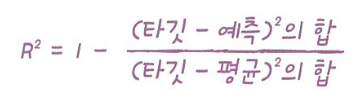

# 3주차

# Chapter 03. 회귀 알고리즘과 모델 규제

## k-최근접 이웃 회귀

**k-최근접 이웃 회귀(K-NN Regression)**

주변의 가장 가까운 K개의 샘플(평균)을 통해 값을 **예측**한다.

`KNeighborsRegressor` 클래스에서 회귀 알고리즘을 구현한다.

```python
from sklearn.neighbors import KNeighborsRegressor

knr = KNeighborsRegressor()

knr.fit(train_input, train_target)
```

### 모델의 평가 방법 - 결정계수

**결정계수 coefficient of determination `R^2`**

예측한 값이 실제 타깃에 가까워지면, 결정계수는 1에 가까운 값이 된다.



```python
print(knr.score(test_input, test_target))
```

결정계수 대신, 타깃과 예측의 절댓값 오차를 평균하는 측정 도구 `mean_absolute_error`를 사용할 수도 있다. 아래 예시의 결과는, 모델이 예측한 값이 실제 타깃값과 평균적으로 32g의 오차를 가짐을 나타낸다.

```python
from sklearn.metrics import mean_absolute_error

test_prediction = knr.predict(test_input)

mae = mean_absolute_error(test_target, test_prediction)
print(mae)
```

### **과대적합과 과소적합**

**과대적합 overfitting**

머신러닝 모델을 학습할 때 학습 데이터셋에 지나치게 최적화되어 발생하는 문제이다.

학습 데이터셋에서는 모델 성능이 높게 나타나지만, 새로운 데이터가 주어졌을 때 정확한 예측을 수행하지 못한다.

**과소적합 underfitting**

머신러닝 모델의 최적화가 제대로 수행되지 않아 학습 데이터의 구조를 정확히 반영하지 못하는 문제이다.

모델을 복잡하게(=훈련 세트에 더 잘 맞도록) 만듦으로써 해결할 수 있다.

아래 모델에서는 훈련 세트보다 테스트세트의 점수가 낮으므로 과대적합이 발생했다.

```python
print(knr.score(test_input, test_target))
```

```python
print(knr.score(train_input, train_target))
```

과대적합을 해결하기 위해 neighbors의 수 k를 조절할 수 있다.

이웃의 개수를 줄이면 훈련 세트에 있는 국지적인 패턴에 민감해지고, (복잡)
이웃의 개수를 늘리면 데이터 전반에 있는 일반적인 패턴을 따르게 된다. (단순)

```python
knr.n_neighbors = 7

knr.fit(train_input, train_target)
```

```python
print(knr.score(test_input, test_target))
```

```python
print(knr.score(train_input, train_target))
```

훈련 데이터보다 테스트 데이터에서 더 높은 점수를 얻었으므로, 과대적합을 해결하였다고 볼 수 있다.

### K-최근접 이웃의 한계

K-최근접 이웃은 결국 이웃 샘플의 평균을 통해 값을 예측하기 때문에, 훈련 세트의 범위를 벗어나는 새로운 값(삼각형)에 대해서는 정확한 예측을 제공하지 않는다. 즉, 아래 그래프에서 length가 엄청나게 커져도 예측되는 weight 값은 1000미만일 수 있다는 것이다. 이러한 문제를 해결하기 위해 선형 회귀를 비롯한 머신러닝 알고리즘을 사용하게 된다.


## 선형 회귀

### 선형 회귀 linear regresstion

특성을 가장 잘 나타내는 하나의 직선을 찾는 알고리즘이다.

모듈 임포트

```python
from sklearn.linear_model import LinearRegression
```

훈련

```python
lr = LinearRegression()
lr.fit(train_input, train_target)
```


기울기는 `lr.coef_`, y절편은 `lr.intercept_`에 저장된다.

```python
print(lr.coef_, lr.intercept_)
```

**선형 회귀의 문제점**

주어진 데이터의 특성이 곡선의 형태로 나타나므로, 데이터의 특성을 온전히 반영하지 못하는 문제가 발생한다. 데이터를 평가해보면 과소적합된 것을 알 수 있다.

```
print(lr.score(train_input, train_target))
print(lr.score(test_input, test_target))
```

### 다항 회귀 polynomial regression

데이터셋에 적합한 곡선을 찾으려면, length의 제곱 항을 훈련 세트에 추가해야 한다. 이처럼 다항식을 사용한 선형 회귀를 `다항 회귀`라고 한다.

```python
train_poly = np.column_stack((train_input ** 2, train_input))
test_poly = np.column_stack((test_input ** 2, test_input))
```

```python
lr = LinearRegression()
lr.fit(train_poly, train_target)

print(lr.predict([[50**2, 50]]))
```

앞선 선형 회귀를 통해 예측한 값보다 더 큰 예측값을 얻었다.

계수는 아래와 같다.

```python
print(lr.coef_, lr.intercept_)
```


```python
print(lr.score(train_poly, train_target))
print(lr.score(test_poly, test_target))
```

데이터에 적합한 모델을 얻었다.

## 특성 공학과 규제

앞선 예제에서는 직접 고차항을 입력해야하는 문제점이 있었다. sklearn의 `PolynomialFeatures` 클래스를 활용하여 해당 문제를 해결할 수 있다.

### 다중 회귀 multiple regression

1개의 특성을 사용했을 때에는 선형 회귀 모델은 직선을 학습한다. 2개의 특성을 사용하면 평면을 학습하게 된다.

여러 개의 특성을 사용하여 선형 회귀를 수행하는 것을 다중 회귀라고 한다.

**특성 공학 feature engineering**

예시에서는 농어의 길이, 높이, 두께 특성을 제공한다. `농어 길이 * 농어 높이`라는 새로운 특성을 추가할 수도 있다. 사이킷런에서는 특성을 만들거나 전처리를 위해 변환기 **`transformer`** 클래스를 제공한다.

**판다스를 이용한 csv file import**

```python
import pandas as pd

df = pd.read_csv('https://bit.ly/perch_csv_data')
perch_full = df.to_numpy()
```

제곱하거나 서로 곱해서 다항 특성을 추가한 모델

```python
from sklearn.linear_model import LinearRegression

lr = LinearRegression()
lr.fit(train_poly, train_target)
print(lr.score(train_poly, train_target))
print(lr.score(test_poly, test_target))
```

테스트 세트에 대한 점수를 높이기 위해 3제곱, 4제곱 항을 추가하자.

```python
poly = PolynomialFeatures(degree=5, include_bias=False)

poly.fit(train_input)
train_poly = poly.transform(train_input)
test_poly = poly.transform(test_input)
```

```python
lr.fit(train_poly, train_target)
print(lr.score(train_poly, train_target))
print(lr.score(test_poly, test_target))
```

특성의 개수를 늘림으로써 훈련 세트에 대한 과대적합이 발생하였다.

### 규제 regularization

훈련 세트에 대해 과대적합이 발생하지 않도록 한다.

선형 회귀 모델에서는 계수의 크기를 작게 만듦으로써 과대적합을 막을 수 있다.

선형 회귀 모델에 규제를 추가한 모델을 **`릿지 ridge`**와 **`라쏘 lasso`**라고 부른다.

릿지는 계수를 곱한 값으로 규제를 적용하고, 라쏘는 계수의 절댓값을 기준으로 규제를 적용한다.

규제를 적용하기 전에, 계수 값의 크기를 고르게 만들기 위해 정규화를 진행한다.

```
from sklearn.preprocessingimport StandardScaler

ss= StandardScaler()
ss.fit(train_poly)

train_scaled= ss.transform(train_poly)
test_scaled= ss.transform(test_poly)
```

### 릿지 회귀

규제를 적용한 ridge 모델을 훈련한다.

```python
from sklearn.linear_model import Ridge

ridge = Ridge()
ridge.fit(train_scaled, train_target)
print(ridge.score(train_scaled, train_target))
print(ridge.score(test_scaled, test_target))
```

alpha 매개변수를 통해 규제의 강도를 조절할 수 있다.

alpha 값이 크면 규제 강도가 세지므로, 계수 값을 줄이고 과소적합되도록 유도한다.
alpha 값이 작으면 계수를 줄이는 역할이 줄어들고 선형회귀 모델과 유사해지므로 과대적합될 가능성이 높아진다.

```python
ridge = Ridge(alpha=0.1)
ridge.fit(train_scaled, train_target)

print(ridge.score(train_scaled, train_target))
print(ridge.score(test_scaled, test_target))
```

### 라쏘 회귀

```python
from sklearn.linear_model import Lasso

lasso = Lasso()
lasso.fit(train_scaled, train_target)
print(lasso.score(train_scaled, train_target))
```

```python
train_score = []
test_score = []

alpha_list = [0.001, 0.01, 0.1, 1, 10, 100]
for alpha in alpha_list:
    # 라쏘 모델을 만듭니다
    lasso = Lasso(alpha=alpha, max_iter=10000)
    # 라쏘 모델을 훈련합니다
    lasso.fit(train_scaled, train_target)
    # 훈련 점수와 테스트 점수를 저장합니다
    train_score.append(lasso.score(train_scaled, train_target))
    test_score.append(lasso.score(test_scaled, test_target))
```

```python
lasso = Lasso(alpha=10)
lasso.fit(train_scaled, train_target)

print(lasso.score(train_scaled, train_target))
print(lasso.score(test_scaled, test_target))
```

라쏘 모델은 유용한 특성을 제외한 나머지 계수를 0으로 만듦으로써, 유용한 특성만 골라낼 수 있다.

```python
print(np.sum(lasso.coef_ == 0))
```

예시에서는 45개의 계수가 0이 되었으며, 이는 55개의 계수 중 실제로 회귀에 사용된 유용한 특성이 10개임을을 의미한다.
