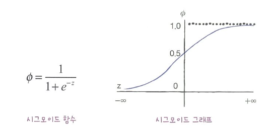

# 4주차

# Chapter 04. 다양한 분류 알고리즘

## 로지스틱 회귀

확률을 구하자

### KNN에서 확률을 구하기

k-최근접 이웃에서는 샘플과 가장 가까운 이웃 샘플의 개수를 확률로 사용한다. 이 데이터는 2개 이상의 생선 클래스로 구성되며, 이러한 문제를 **`다중 분류 multiclass classification`**이라고 한다.

```python
import pandas as pd
fish = pd.read_csv('https://bit.ly/fish_csv_data')
fish.head()

# Species 열을 제외한 나머지 열을 입력 데이터로 사용
fish_input = fish[['Weight', 'Length', 'Diagonal', 'Height', 'Width']].to_numpy()
fish_target = fish['Species'].to_numpy()

# 훈련 세트와 테스트 세트로 분리
from sklearn.model_selection import train_test_split
train_input, test_input, train_target, test_target = train_test_split(fish_input, fish_target)

# 데이터 정규화
from sklearn.preprocessing import StandardScaler
ss = StandardScaler()
ss.fit(train_input)
train_scaled = ss.transform(train_input)
test_scaled = ss.transform(test_input)
```

```python
# KNN classifier를 이용한 모델 훈련
from sklearn.neighbors import KNeighborsClassifier
kn = KNeighborsClassifier(n_neighbors=3)
kn.fit(train_scaled, train_target)
print(kn.score(train_scaled, train_target))
print(kn.score(test_scaled, test_target))
```

`predict_proba()` 를 통해 각 샘플에 대한 클래스 별 확률값을 반환할 수 있다.

```python
import numpy as np
proba = kn.predict_proba(test_scaled[:5])
print(np.round(proba, decimals=4))
```

```python
[[0.     0.     **0.6667** 0.     **0.3333** 0.     0.    ]
 [0.     0.     0.3333 0.6667 0.     0.     0.    ]
 [0.     0.     0.     1.     0.     0.     0.    ]
 [0.     0.     0.6667 0.     0.     0.     0.3333]
 [0.     0.     0.     1.     0.     0.     0.    ]]
```

첫번째 샘플에서, 3열 `Perch 0.6667`과 5열 `Roach 0.3333`은 첫번째 샘플의 이웃으로 Perch가 2개, Roach가 1개 있어 2/3의 확률로 샘플을 Perch로 예측했음을 의미한다.

하지만 이러한 확률 계산은 전체 데이터에서 특정 샘플이 어떤 클래스에 속할 수 있는지를 보여준다고 볼 수는 없다.

### 로지스틱 회귀 logistic regression

선형 방정식을 학습하는 분류 모델이다.

**`시그모이드 함수 sigmoid function` `(로지스틱 함수 logistic function)`**를 사용하여 선형 방정식의 출력 z 값을 0과 1 사이로 보정한다.



**로지스틱 회귀로 이진 분류 수행하기**

이진 분류에서, 시그모이드 함수의 출력이 0.5보다 크면 양성 클래스, 0.5보다 작으면 음성 클래스로 판단된다.

**`boolean indexing`**을 통해 도미와 빙어 행만 선택한다.

```python
# boolean indexing을 통한 도미와 빙어 행 선택
bream_smelt_indexes = (train_target == 'Bream') | (train_target == 'Smelt')
train_bream_smelt = train_scaled[bream_smelt_indexes]
target_bream_smelt = train_target[bream_smelt_indexes]
```

sklearn의 LogisticRegression 클래스를 통해 모델을 학습시킨다.

```python
# 로지스틱 회귀 모델 훈련
from sklearn.linear_model import LogisticRegression
lr = LogisticRegression()
lr.fit(train_bream_smelt, target_bream_smelt)
```

```python
# 예측
print(lr.predict(train_bream_smelt[:5]))
```

```python
# 예측 확률
# 첫 번째 열이 음성 클래스(0)에 대한 확률, 두 번째 열이 양성 클래스(1)에 대한 확률
print(lr.predict_proba(train_bream_smelt[:5]))
```

회귀 모델이 학습한 계수를 출력한다.

```python
print(lr.coef_, lr.intercept_)
```

회귀 모델로 선형 방정식의 출력인 z 값을 출력한다.

```python
decisions = lr.decision_function(train_bream_smelt[:5])
print(decisions)
```

이 z 값을 시그모이드 함수에 통과시킴으로써 확률을 얻는다.

```python
# 시그모이드 함수로 확률 계산
from scipy.special import expit
print(expit(decisions))
```

**로지스틱 회귀로 다중 분류 수행하기**

`LogisticRegression`은 릿지 회귀와 마찬가지로 계수의 제곱을 규제한다. 이러한 규제를 **`L2규제`**라고 부른다.

`LogisticRegression`에서 규제의 정도를 조절하는 매개변수는 C이며, C가 작을 수록 규제가 커진다.

```python
lr = LogisticRegression(C=20, max_iter=1000) # 규제 완화를 위해 C 지정, 반복 횟수를 늘리기 위해 max_iter 조정
lr.fit(train_scaled, train_target) # 모든 종류의 생선이 포함된 데이터를 사용
print(lr.score(train_scaled, train_target))
print(lr.score(test_scaled, test_target))
```

```python
# 예측
print(lr.predict(test_scaled[:5]))
```

```python
proba = lr.predict_proba(test_scaled[:5])
print(np.round(proba, decimals=3))
```

클래스 개수 만큼의 확률을 출력한다.

다중 분류는 클래스마다 z값을 하나씩 계산하며, 가장 높은 z값을 출력하는 클래스가 예측 클래스가 된다. 이때, 확률은 시그모이드 함수 대신 **`소프트맥스 softmax 함수`**를 사용하여 변환한다.


```python
# z값 계산
decision = lr.decision_function(test_scaled[:5])
print(np.round(decision, decimals=2))
```

```python
# softmax 함수를 통해 0과 1 사이의 확률로 변환
from scipy.special import softmax
proba = softmax(decision, axis=1)
print(np.round(proba, decimals=3))
```

## 확률적 경사 하강법

### 확률적 경사 하강법

조금씩 업데이트되는 데이터를 어떻게 훈련할 수 있을까?

**`점진적 학습`**은 기존에 훈련된 모델을 버리지 않고 새로운 데이터에 대해서만 훈련할 수 있도록 하는 훈련 방식이다. **`확률적 경사 하강법 Stochastic Gradient Descent`**은 대표적인 점진적 학습 알고리즘이다.

경사 하강법에서는 훈련 세트에서 하나의 샘플을 **랜덤하게** 골라 가장 **경사가 가파른** 길을 탐색한다. 확률적 경사 하강법에서 훈련 세트를 한 번 모두 사용하는 과정을 **`에포크 epoch`**라고 부른다.

하나의 샘플 대신 여러 개의 샘플을 사용해서 경사 하강법을 수행하는 `미니배치 경사 하강법 minibatch gradient descent`, 전체 샘플을 사용하여 수행하는 `배치 경사 하강법 batch gradient descent`도 있다.

### 손실 함수

**`손실 함수 loss function`**는 예측한 값과 실제 값의 차를 특정하는 함수이다.

손실 함수는 미분 가능해야한다.

`로지스틱 손실 함수 logistic loss function` `(이진 크로스엔트로피 손실 함수 binary cross-entropy loss function)`는 이진 분류에서 사용가능한 손실 함수이며, 이 손실 함수를 이용하면 로지스틱 회귀 모델을 만들 수 있다.

양성 클래스(target = 1)일 때,

$$
손실 = -log(예측 확률)
$$

음성 클래스(target = 0)일 때,

$$
손실 = -log(1-예측 확률)
$$

다중 분류에서는 `크로스엔트로피 손실 함수 cross-entropy loss function`를 사용한다.

사이킷런에서 제공하는 `SGDClassifier` 클래스를 사용하여 확률적 경사 하강법을 수행할 수 있다.

```python
# 확률적 경사 하강법을 제공하는 클래스
from sklearn.linear_model import SGDClassifier
sc = SGDClassifier(loss='log_loss', max_iter=10) # OvR(One versus Rest)
sc.fit(train_scaled, train_target)
print(sc.score(train_scaled, train_target))
print(sc.score(test_scaled, test_target))
```

loss=’log’로 지정함으로써 다중 분류에서 클래스마다 이진 분류 모델을 만드는 `OvR` 방식을 수행할 수 있다.

정확도가 낮으므로 `partial_fit()` 함수를 통해 모델을 이어서 훈련하자.

```python
sc.partial_fit(train_scaled, train_target)
print(sc.score(train_scaled, train_target))
print(sc.score(test_scaled, test_target))
```

### 에포크와 과대/과소적합

에포크 횟수가 적음 > 덜 학습함 > 과소적합

에포크 횟수가 많음 > 훈련세트에너무맞음 > 과대적합


과대 적합이 시작되기 전에 훈련을 멈추는 것을 `조기 종료 early stopping` 라고 한다.

```python
# 에포크와 과대적합 과소적합
import numpy as np
sc = SGDClassifier(loss='log_loss')
train_score = []
test_score = []
classes = np.unique(train_target)
```

```python
for _ in range(0, 300):
    sc.partial_fit(train_scaled, train_target, classes=classes)

    train_score.append(sc.score(train_scaled, train_target))
    test_score.append(sc.score(test_scaled, test_target))
```

```python
import matplotlib.pyplot as plt

plt.plot(train_score)
plt.plot(test_score)
plt.xlabel('epoch')
plt.ylabel('accuracy')
plt.show()
```


100번째 에포크 이후로 테스트 세트의 점수가 낮아지는 것을 확인할 수 있다.

반복 횟수를 100회로 지정하여 모델을 다시 훈련해보자.

```python
sc = SGDClassifier(loss='log_loss', max_iter=100, tol=None)
sc.fit(train_scaled, train_target)
print(sc.score(train_scaled, train_target))
print(sc.score(test_scaled, test_target))
```

---

1. **`stratify`** 를 사용하면 모수를 반영하여 데이터를 분리하므로 편향을 방지할 수 있다는 내용을 2주차에서 학습했습니다. 그런데, 이번 주차에서 KNN 모델을 사용할 때에는 stratify를 사용하지 않고 데이터를 분리했습니다. 혹시 stratify를 사용하지 않는 것에 이유가 있을까요?
2.
