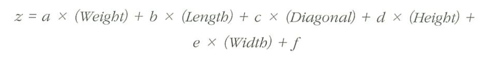
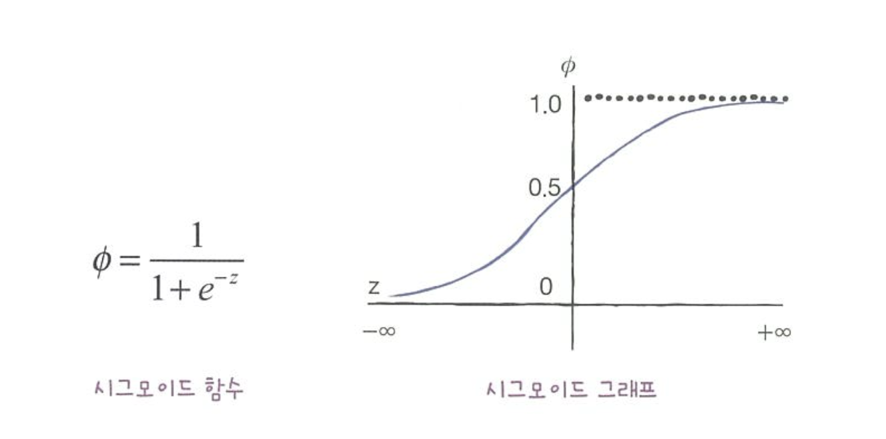

# 4-1 로지스틱 회귀(Logistic Regression)

## **1. 로지스틱 회귀란?**

- 로지스틱 회귀는 **이진 분류(Binary Classification)** 문제를 해결하기 위해 사용되는 회귀 모델.
- 선형 회귀를 기반으로 하지만, 결과 값을 **확률(0~1 범위)**로 변환하여 분류에 적용함.
- 대표적인 **시그모이드(Sigmoid) 함수**를 사용하여 예측 값을 확률 값으로 변환함.

---

## **2. 로지스틱 회귀 공식**

### **2.1 선형 회귀 식**

로지스틱 회귀는 선형 회귀의 결과를 확률로 변환하는 방식으로 작동함.  
선형 회귀의 기본 식:

\[
z = w_1x_1 + w_2x_2 + \dots + w_nx_n + b
\]

- \( w_1, w_2, ..., w_n \) : 각 특성(feature)의 가중치(Weight)
- \( x_1, x_2, ..., x_n \) : 입력 데이터(Feature)
- \( b \) : 편향(Bias)

---

### **2.2 시그모이드(Sigmoid) 함수**

로지스틱 회귀에서는 선형 회귀 식의 출력을 확률 값으로 변환하기 위해 **시그모이드 함수**를 사용함.

\[
\sigma(z) = \frac{1}{1 + e^{-z}}
\]

이 함수는 입력 값 \( z \)를 **0과 1 사이의 확률 값**으로 변환함.

- \( \sigma(z) \) 값이 0.5 이상이면 **1 (True, 양성 클래스)**
- \( \sigma(z) \) 값이 0.5 미만이면 **0 (False, 음성 클래스)**

---

### **2.3 로지스틱 회귀 모델**

시그모이드 함수를 적용한 최종 예측 식:

\[
P(Y=1 | X) = \frac{1}{1 + e^{-(w_1x_1 + w_2x_2 + ... + w_nx_n + b)}}
\]

여기서:

- \( P(Y=1 | X) \) : 입력 \( X \)에 대한 **클래스 1일 확률**
- \( w_1, w_2, ..., w_n \) : 학습된 모델의 가중치
- \( x_1, x_2, ..., x_n \) : 입력 데이터

---

## **3. 비용 함수 (Log Loss)**

로지스틱 회귀에서 사용하는 손실 함수는 **로그 손실(Log Loss, Binary Cross-Entropy)**.

\[
J(w) = -\frac{1}{m} \sum\_{i=1}^{m} \left[ y_i \log(\hat{y}_i) + (1 - y_i) \log(1 - \hat{y}_i) \right]
\]

여기서:

- \( y_i \) : 실제 클래스 (0 또는 1)
- \( \hat{y}\_i \) : 예측 확률 값 (\( \sigma(z) \))
- \( m \) : 샘플 개수
- 로그 손실은 **예측이 정답과 멀어질수록 값이 커지며, 정확한 예측일수록 값이 작아짐.**

---

## **4. 모델 학습 방법 (경사 하강법)**

로지스틱 회귀는 **경사 하강법(Gradient Descent)**을 사용하여 최적의 가중치 \( w \)와 편향 \( b \)을 찾음.

- 비용 함수 \( J(w) \)의 편미분을 계산하여 가중치를 업데이트.
- 업데이트 식:

\[
w_j := w_j - \alpha \frac{\partial J(w)}{\partial w_j}
\]

\[
b := b - \alpha \frac{\partial J(w)}{\partial b}
\]

여기서:

- \( \alpha \) : 학습률 (Learning Rate), 너무 크면 발산, 너무 작으면 학습 속도 저하
- \( \frac{\partial J}{\partial w_j} \), \( \frac{\partial J}{\partial b} \) : 비용 함수의 기울기

---

## **5. 결정 경계(Decision Boundary)**

- 로지스틱 회귀에서 **결정 경계(Decision Boundary)**는 **시그모이드 함수의 출력이 0.5가 되는 지점**을 기준으로 설정됨.
- 결정 경계 식:

\[
w_1x_1 + w_2x_2 + ... + w_nx_n + b = 0
\]

- 이 식을 만족하는 데이터 포인트가 **클래스 0과 클래스 1을 구분하는 기준**이 됨.

---

## **6. 다중 클래스 분류 (Softmax Regression)**

로지스틱 회귀는 기본적으로 **이진 분류(Binary Classification)**에 사용되지만, 다중 클래스 문제에서는 **소프트맥스 회귀(Softmax Regression)**를 사용함.

- 소프트맥스 함수:

\[
P(y*i = k | x) = \frac{e^{z_k}}{\sum*{j=1}^{K} e^{z_j}}
\]

- 각 클래스 \( k \)에 대한 확률을 계산하여 가장 높은 확률을 가진 클래스를 예측함.

---

## **7. 로지스틱 회귀의 한계**

1. **선형적으로 구분되지 않는 데이터에 취약**

   - 결정 경계가 직선(또는 평면)이기 때문에, 복잡한 비선형 데이터는 제대로 학습하지 못할 수 있음.
   - 해결책: **다항 특징 추가(Polynomial Features) 또는 비선형 모델(SVM, 신경망) 사용**.

2. **이상치(Outlier)에 민감**

   - 한 개의 이상치가 모델에 큰 영향을 미칠 수 있음.
   - 해결책: **이상치 제거 또는 로버스트 스케일링 적용**.

3. **변수 간 독립성이 중요**
   - 로지스틱 회귀는 설명 변수(Feature) 간 다중 공선성(Multicollinearity)이 있으면 성능이 저하될 수 있음.
   - 해결책: **VIF(Variance Inflation Factor) 분석 후 불필요한 변수 제거**.

## Question

사이킷런이 왜 0.5를 이진분류에서 음성클래스로 판단하는가? 반올림이론이 아닌가

소프트맥스 함수?

# 4-2 확률적 경사 하강법

확률적 경사 하강법 (SGD, Stochastic Gradient Descent)

확률적 경사 하강법(SGD, Stochastic Gradient Descent)은 경사 하강법(Gradient Descent)의 변형된 최적화 알고리즘 중 하나로, 매번 하나의 데이터 샘플을 사용하여 가중치를 업데이트하는 방식.

# 배치 경사 하강법 (BGD) vs 확률적 경사 하강법 (SGD)

| 방식                         | 업데이트 방식       | 연산 속도                          | 메모리 사용량              | 최적화 성능                      | 진동 현상      |
| ---------------------------- | ------------------- | ---------------------------------- | -------------------------- | -------------------------------- | -------------- |
| **배치 경사 하강법 (BGD)**   | 전체 데이터셋 사용  | 느림 (데이터셋 클수록 연산량 증가) | 큼 (전체 데이터 저장 필요) | 지역 최적해에 빠질 위험 있음     | 안정적 수렴    |
| **확률적 경사 하강법 (SGD)** | 1개 샘플씩 업데이트 | 빠름 (즉시 업데이트)               | 적음 (1개 샘플만 사용)     | 지역 최적해를 벗어날 가능성 있음 | 진동 발생 가능 |

---

## 언제 SGD를 사용하고 언제 미니배치를 사용할까?

| 방식                            | 장점                                          | 단점                              | 사용 사례             |
| ------------------------------- | --------------------------------------------- | --------------------------------- | --------------------- |
| **배치 경사 하강법 (BGD)**      | 수렴 안정적, 최적해를 정확히 찾음             | 연산량 큼, 대용량 데이터에 부적합 | 데이터셋이 작을 때    |
| **확률적 경사 하강법 (SGD)**    | 빠름, 실시간 학습 가능, 지역 최적해 탈출 가능 | 진동 심함, 수렴 불안정            | 온라인 학습, 빅데이터 |
| **미니배치 경사 하강법 (MBGD)** | 속도와 안정성 균형                            | 조절이 필요                       | 딥러닝, 머신러닝      |

## **1. 로지스틱 손실 함수 (이진 크로스엔트로피)**

- 이진 분류에서 사용되는 손실 함수.
- 로지스틱 회귀(Logistic Regression)와 신경망에서 많이 사용됨.
- 모델이 예측한 확률 값과 실제 정답 간의 차이를 줄이는 역할을 함.

### **손실 함수 공식**

\[
J(w) = -\frac{1}{m} \sum\_{i=1}^{m} \left[ y_i \log(\hat{y}_i) + (1 - y_i) \log(1 - \hat{y}_i) \right]
\]

- \( y_i \) : 실제 정답 (0 또는 1)
- \( \hat{y}\_i \) : 예측 확률 값
- \( m \) : 전체 샘플 개수

### **특징**

- 모델이 확률 값이 1에 가까운 경우 손실이 작아짐.
- 예측이 완전히 틀린 경우(예: 정답이 1인데 0을 예측) 손실 값이 커짐.
- 확률 값이 0.5를 기준으로 클래스를 구분하게 됨.

---

## **2. `SGDClassifier`**

- **확률적 경사 하강법(SGD, Stochastic Gradient Descent)**을 사용하여 분류 모델을 학습하는 사이킷런(`scikit-learn`)의 클래스.
- **대규모 데이터셋에서도 빠르게 학습 가능**한 장점이 있음.
- 로지스틱 회귀, SVM 등 다양한 모델을 지원.

### **사용 방법**

- `loss` 매개변수로 다른 손실 함수 지정 가능함.
  - `loss="log_loss"` : 로지스틱 회귀 (이진 분류)
  - `loss="hinge"` : SVM
- 기본적으로 **SGD를 이용하여 가중치를 반복적으로 업데이트**하며 학습 진행.

### **주요 매개변수**

- `max_iter`: 최대 반복 횟수 (기본값 1000)
- `learning_rate`: 학습률 조절 방식 (`constant`, `optimal`, `adaptive` 등)
- `alpha`: L2 정규화 강도 (과적합 방지)

### **장점**

- 전체 데이터셋을 한 번에 처리하는 게 아니라, **한 개의 샘플씩 학습하여 빠르게 업데이트 가능**함.
- 온라인 학습(스트리밍 데이터)에 적합함.

### **단점**

- 데이터가 많지 않거나, 샘플에 노이즈가 많으면 학습이 불안정할 수 있음.
- 최적의 학습률(learning rate)을 찾기가 어려움.

---

## **정리**

| 개념                              | 설명                                                                                                            |
| --------------------------------- | --------------------------------------------------------------------------------------------------------------- |
| **이진 크로스엔트로피 손실 함수** | 로지스틱 회귀와 신경망에서 사용되는 손실 함수. 예측 확률과 실제 정답 간 차이를 최소화함.                        |
| **SGDClassifier**                 | 확률적 경사 하강법(SGD)을 이용한 사이킷런 분류 모델. 대규모 데이터 학습에 적합하며, 다양한 손실 함수 선택 가능. |
